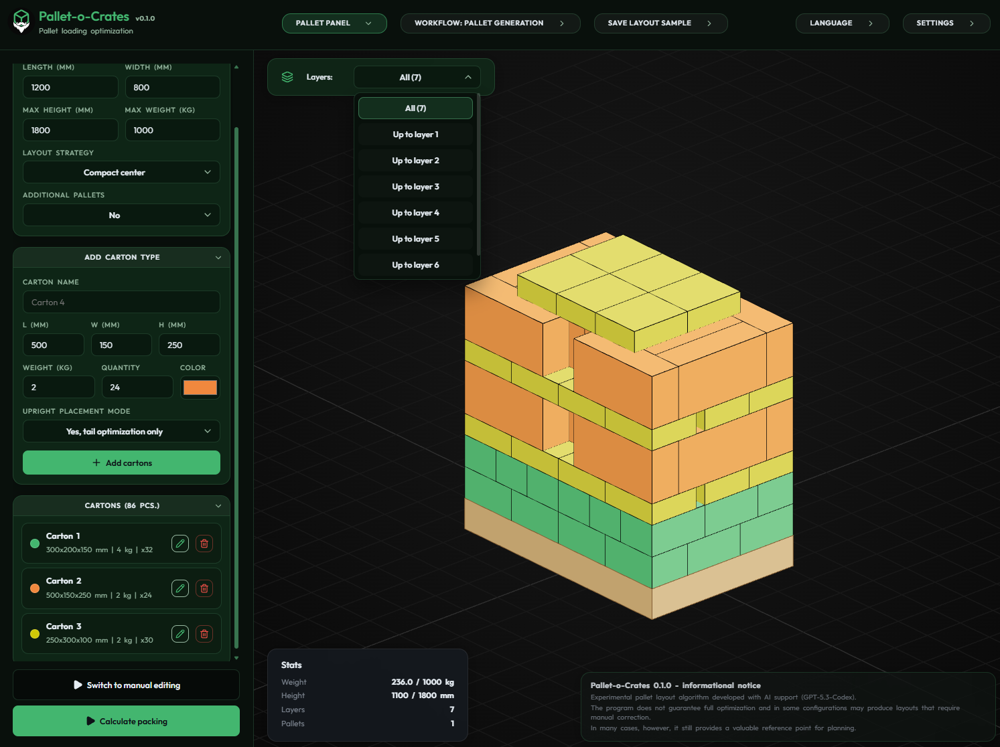

# Pallet-o-Crates

Experimental pallet loading planner for mixed carton sets.



## What It Is

Pallet-o-Crates generates pallet layouts for multiple carton types under practical constraints:

- pallet footprint
- maximum height
- maximum weight
- carton orientation rules
- support and stacking safety heuristics

It also includes:

- manual 3D editing
- layout sample saving
- sample-guidance / template-lock workflow
- multilingual UI

## Current Status

This project is usable, but still experimental.

- It can generate sensible layouts for many common cases.
- It is not guaranteed to produce the global optimum.
- Some mixed-shelf and bulky late-stage cases still benefit from manual adjustment or saved samples.

Treat it as a planning and reference tool, not as an authoritative warehouse system.

## Safety / Packing Model

The packer keeps hard validity rules such as:

- no carton may exceed pallet bounds
- no carton collisions
- pallet weight and height limits
- support / pressure / structural checks
- cumulative stack-load checks

There is also a softer heuristic layer for:

- edge-aligned vs center-compact style
- height reduction
- reduced fragmentation
- better interlocking between layers

See [docs/packing-constraints-conflicts.md](docs/packing-constraints-conflicts.md) for the current high-level rule model.

## Local Run

```bash
npm install
npm run build
npm run dev
```

Useful checks:

```bash
npm run check:i18n
npm run test:regression
npm run benchmark:packer
```

## Known Limitations

- Layout quality is heuristic, not guaranteed optimal.
- Guidance-heavy scenarios can be slower than basic packing runs.
- Translation quality varies by language; some locales are community-draft quality.

## Contributing

Small, focused contributions are welcome.

Start here:

- [CONTRIBUTING.md](CONTRIBUTING.md)

## License

[LICENSE](LICENSE)
