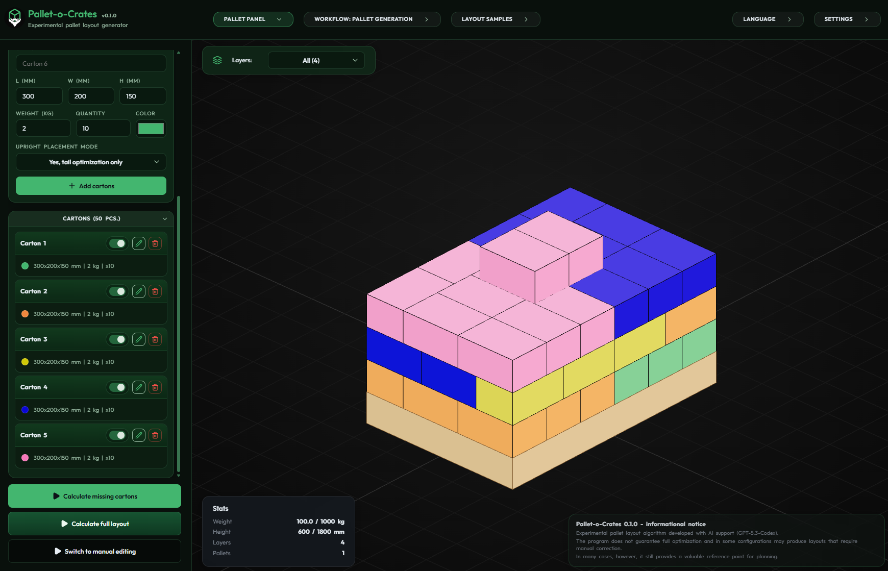
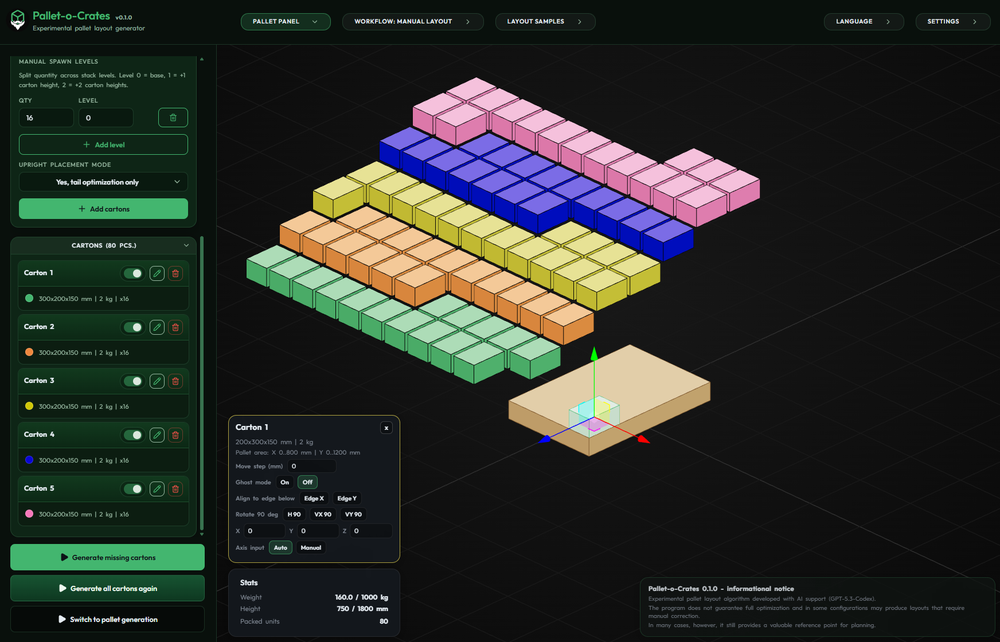
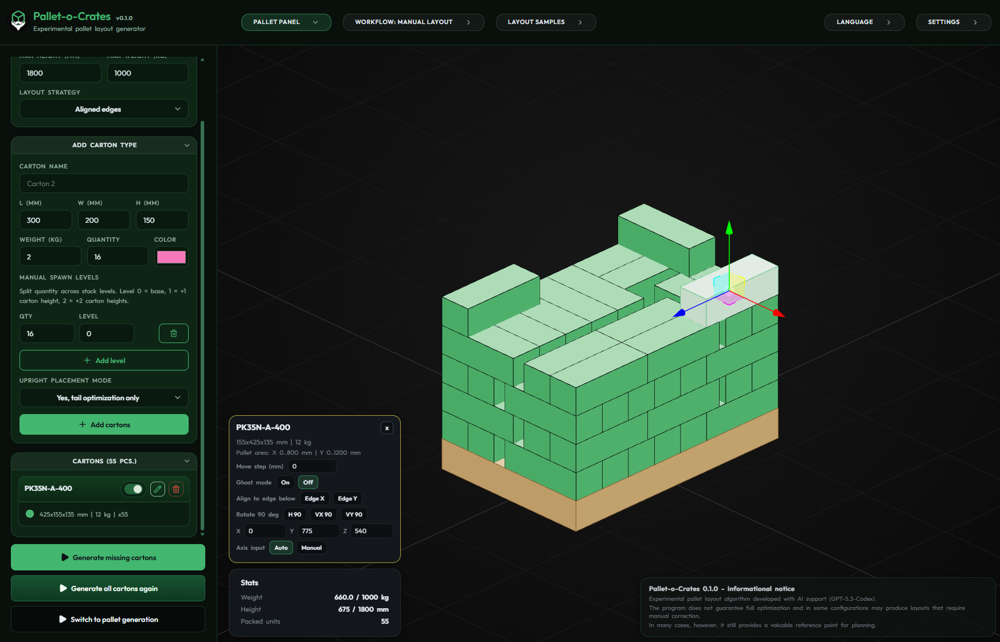
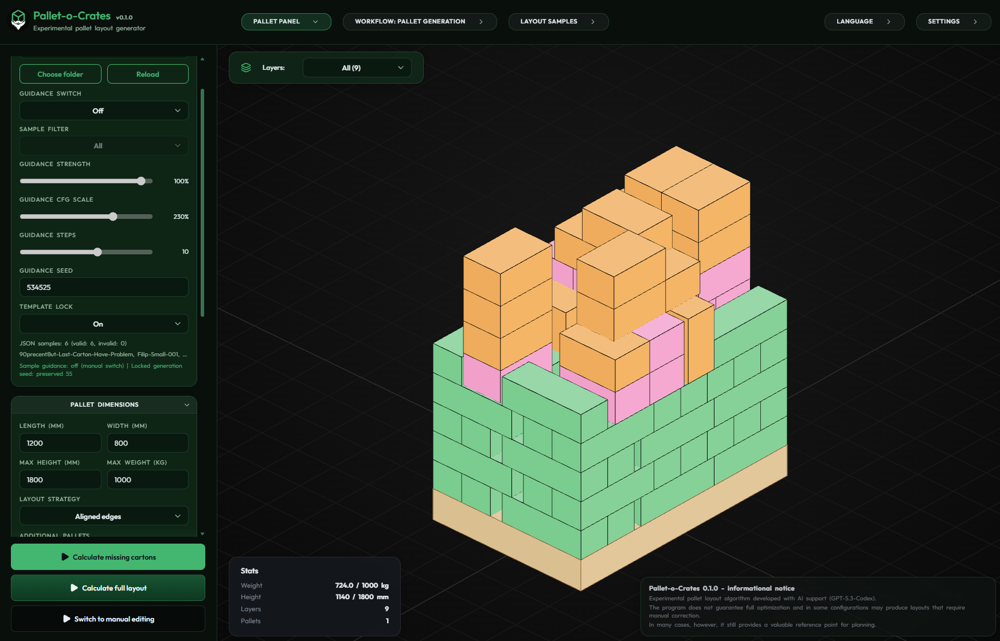
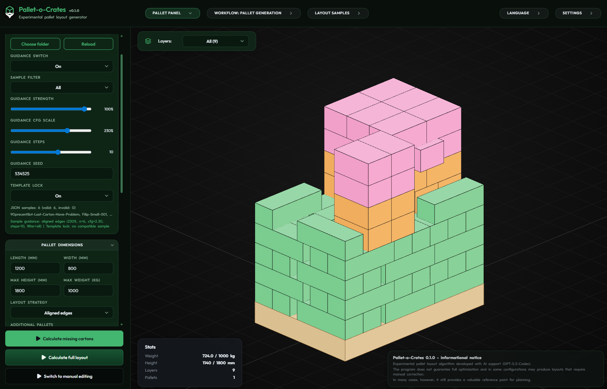

# Pallet-o-Crates

Experimental pallet layout generator for mixed carton sets.

Pallet-o-Crates is a Tauri desktop tool for generating pallet layouts, switching into manual 3D editing, saving layout samples, and reusing a sample database to guide follow-up runs. It is meant for planning, iteration, and experimentation, not for claiming a guaranteed global optimum.



`00` shows a clean baseline generation pass: five carton groups, identical dimensions, readable result.

## Showcase

<table>
  <tr>
    <td></td>
    <td></td>
  </tr>
  <tr>
    <td><strong>01</strong>: the same carton set opened in manual mode, intentionally staged off-pallet to show the base editing workspace.</td>
    <td><strong>02</strong>: a harder manual case built around a real PK35N-A-400 layout, showing how the user can refine or reconstruct a difficult arrangement directly.</td>
  </tr>
  <tr>
    <td></td>
    <td></td>
  </tr>
  <tr>
    <td><strong>03</strong>: missing cartons generated without sample guidance. Valid demo, but visibly chaotic. This is an honest example of the current heuristic limits.</td>
    <td><strong>04</strong>: the same follow-up scenario with sample database guidance enabled. Still not perfect, but clearly less chaotic than the unguided pass.</td>
  </tr>
</table>

## What It Does

- generates pallet layouts under footprint, height, weight, support, and stacking constraints
- supports full generation and missing-carton follow-up generation
- lets you switch to manual 3D editing for correction, staging, and experimentation
- saves layout samples as reusable JSON references
- uses sample guidance and template-lock workflow to preserve useful structure between runs
- ships with a multilingual UI

## Experimental Status

This project is usable, but it is still experimental.

- It often produces practical layouts for common cases.
- It does not guarantee full optimization or a global best result.
- Difficult mixed cases can still become noisy and may require manual cleanup.
- Sample guidance can improve coherence, but it is an assistive heuristic, not a magic solver.

Treat it as a planning and reference tool, not as an authoritative warehouse optimizer.

## Why The Sample Database Exists

The sample database is there to make follow-up generation less blind.

- Without guidance, missing-carton generation can preserve validity while drifting into visibly rough placements.
- With guidance and template lock, the app can often keep more of the original structure and produce calmer follow-up layouts.
- The screenshot pair `03` vs `04` is the intended honest demo: improvement, not perfection.

## Languages

The UI currently ships with `138` languages.

- `pl` and `en` are currently marked as human-verified in the language picker.
- Most other locales are still machine-draft or AI-assisted and need native-speaker review.
- Translation status badges are visible directly in the language list.

If you are a native speaker and want to help, translation review is one of the highest-value contribution paths in this repo. Start with [CONTRIBUTING.md](CONTRIBUTING.md), [docs/localization-workflow.md](docs/localization-workflow.md), and [docs/i18n-language-status.md](docs/i18n-language-status.md).

## Platform / Release Status

- If a tagged Windows build is published, the intended end-user entry point is the GitHub Releases page.
- The current automated GitHub release pipeline builds Windows artifacts.
- Other platforms can still be built from source through Tauri, but are not yet shipped as first-class release targets in GitHub Actions.
- Public releases should currently be read as `0.x` experimental releases.

## Command Basics

There are two different development entry points:

- `npm run tauri dev`: main desktop app workflow, recommended for real feature testing
- `npm run dev`: Vite frontend only, useful for fast UI work but not a full Tauri runtime check

The same distinction applies to builds:

- `npm run tauri build`: desktop package build
- `npm run build`: frontend production build plus TypeScript and i18n checks

A fuller command map lives in [docs/command-reference.md](docs/command-reference.md).

## Local Run

Requirements:

- Node.js 20
- Rust stable toolchain
- Tauri 2 toolchain

Run locally:

```bash
npm install
npm run tauri dev
```

Desktop build:

```bash
npm run tauri build
```

Frontend-only build and checks:

```bash
npm run dev
npm run build
npm run preview
npm run test:regression
npm run check:i18n
```

## Known Limitations

- Layout quality is heuristic, not guaranteed optimal.
- Some difficult mixed-carton or late-stage top-off cases still need manual intervention.
- Sample guidance helps only when the sample set is relevant and clean.
- Translation coverage is broad, but review quality is uneven across languages.

## Contributing

Small, focused contributions are welcome.

- bug fixes
- packing-quality improvements
- regression tests and benchmarks
- documentation cleanup
- native-speaker translation review

Start here: [CONTRIBUTING.md](CONTRIBUTING.md)

## Support

If you find the project useful and want to support ongoing development, you can do that here:

<a href="https://www.buymeacoffee.com/nulltmaker" rel="noopener noreferrer">
  
</a>

## License

[LICENSE](LICENSE)
